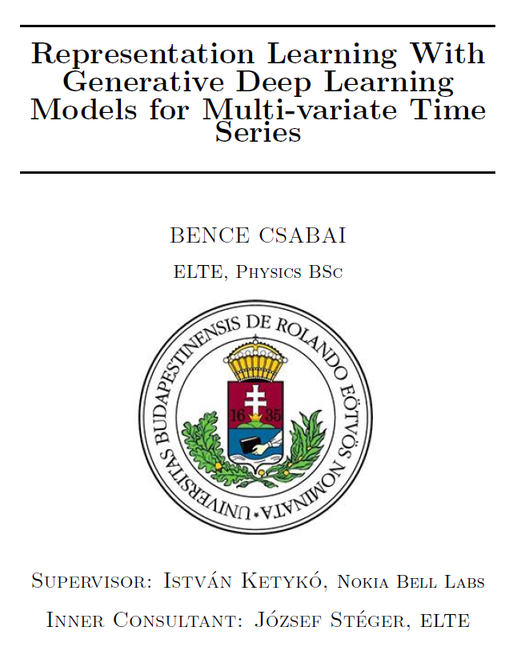
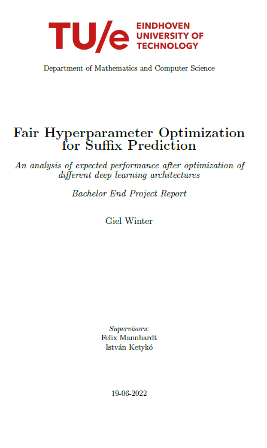
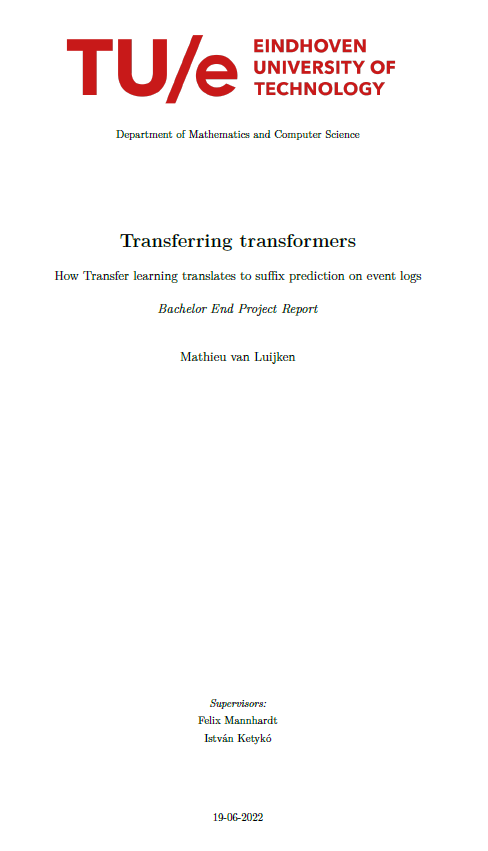
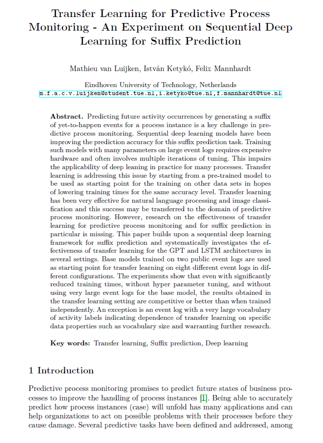
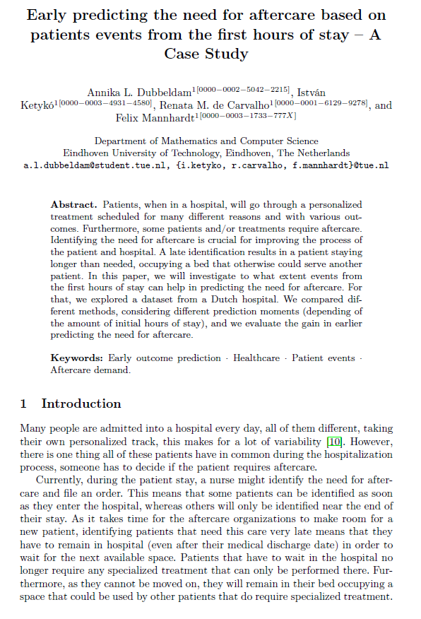
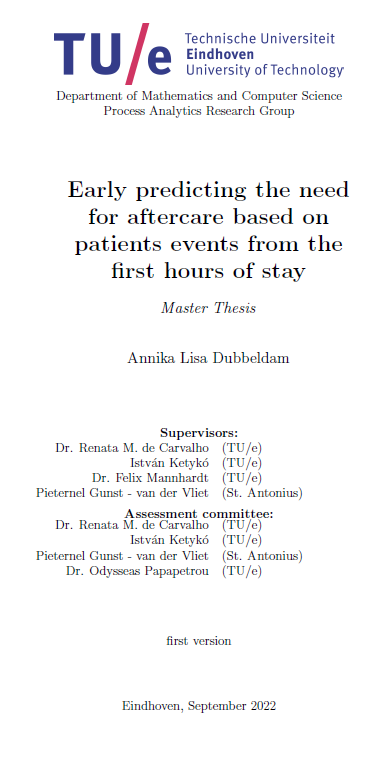

# Representation Learning With Generative Deep Learning Models for Multi-variate Time Series (ELTE, 2021)

# Fair Hyperparameter Optimization for Suffix Prediction (TU/e, 2022)

# Transferring Transformers (TU/e, 2022)

# Transfer Learning for Predictive Process Monitoring (TU/e, 2022)

# Early predicting the need for aftercare based on patients events from the first hours of stay (TU/e, 2022)

# Early predicting the need for aftercare based on patients events from the first hours of stay (TU/e, 2022)

